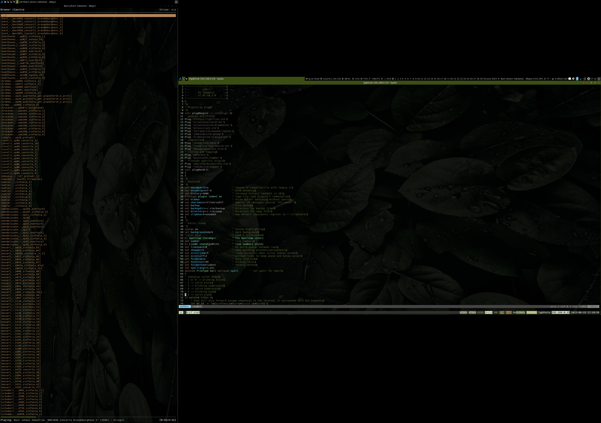

# dotfiles

These are configuration files for my GNU/Linux workstation.

## Toolbox

* shell: `bash`
* core tools: `lsd, fzf, fd, git-delta, procs, duf, ncdu, zoxide, btop, curlie, ripgrep, bat, prettyping`
* terminal: `urxvt`
* terminal multiplexer: `tmux + byobu + tmuxp`
* wm: `awesome`
* editor: `vim`, `neovim`
* file manager: `ranger`
* file manager gui: `thunar`
* email: `mutt` + `notmuch` + `msmtp` + `lbdb` + `offlineimap`
* pim: `khal` + `todoman` + `vdirsyncer`
* wiki/notes: `ranger` + `vim` + some wrapper bash functions
* feed: `newsboat` + `w3m` + [custom script](https://gist.github.com/lgaggini/f0d0e119a0ab4410943dd227370f6fe6)
* ide: `neovim`
* ide gui: `neovide`
* versioning: `git`
* music: `mpd` + `mpc` + `ncmpcpp` + `rofi-mpc`
* browser: `w3m`
* surfer: `surfraw` + `w3m` + [custom script](https://gist.github.com/lgaggini/f0d0e119a0ab4410943dd227370f6fe6)
* password manager: `pass`
* password manager gui: `rofi-pass`
* clipboard manager: `greenclip + rofi`
* personal finance: `ledger`
* document viewer:  `zathura`
* backup: `restic`
* irc: `weechat`
* calculator: `rofi-calc`
* snippet-manager: `rofi-snippy`

## Usage
There are many [available solutions](http://dotfiles.github.com/) to manage dotfiles. I use a very simple approach. I have a dedicated folder repo, dotfiles, where i copy manually every files to track. After the first manually copy, i sync my dotfiles by `--existing` options of `rsync`, that syncs two folder only for files present in the destination. In my bash functions i have the function dots:

    rsync -a -v --existing /home/lorenzo/ /home/lorenzo/code/dotfiles/

When on a new machine i clone my github dotfiles repository and copy manually configuration files in the right place.
That's all, no much automation but very simple.

## Screenshoots
* urxvt + rofi

* fzf + ranger

* vim + ncmpcpp

## Credits
* [Awesome-archKiss theme by me](https://github.com/lgaggini/awesome-archKiss)
* [Archlinux wallpaper by giancarlo64](https://www.deviantart.com/giancarlo64/art/ArchLinux-Wallpaper-360078960)
* [Nature wallpaper by sohail nachiti](https://www.pexels.com/photo/close-up-photography-of-leaves-with-droplets-807598/)
